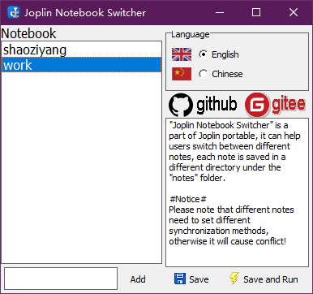

# JoplinPortable

Joplin portable with notebook switcher 

Although there is a officially portable version available, it is not convenient. Because the official portable version is a self extracting file, it will extract to a temporary folder before running. Moreover, because the file is large (hundreds of megabytes), it takes some time to decompress, and there will be a delay in startup, it also speeds up the wear of SSD disks.

**Joplin Portable** is fast and simple, with notebook switch function. Notebooks saved under different folder under the "Notes" folder, you may switch between notebook use **JoplinSwitch.exe**.

To reduce file size, JoplinPortable does not include Joplin execute files, you need download and install it first, then copy them to JoplinPortable\App\Joplin folder. When Joplin upgrade, just copy new files to JoplinPortable\App\Joplin folder.

## Joplin Portable folder

```
JoplinPortable
├─App
│  └─Joplin
└─Data
   ├─Notebook1
   └─Notebook2

```

Joplin Switcher 


